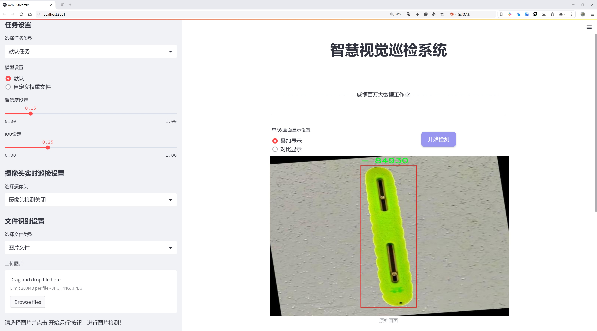
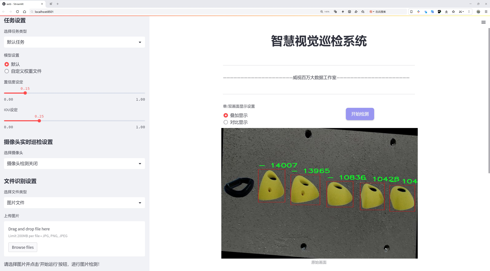
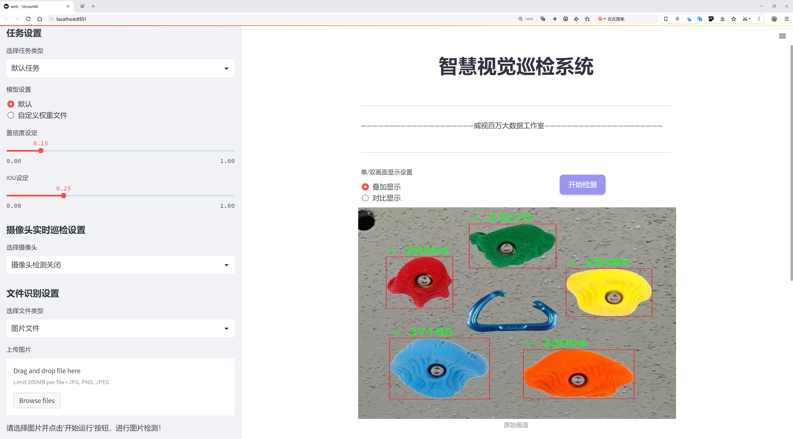
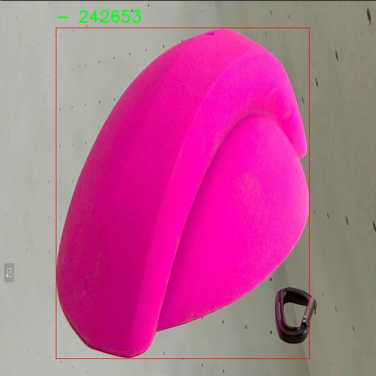
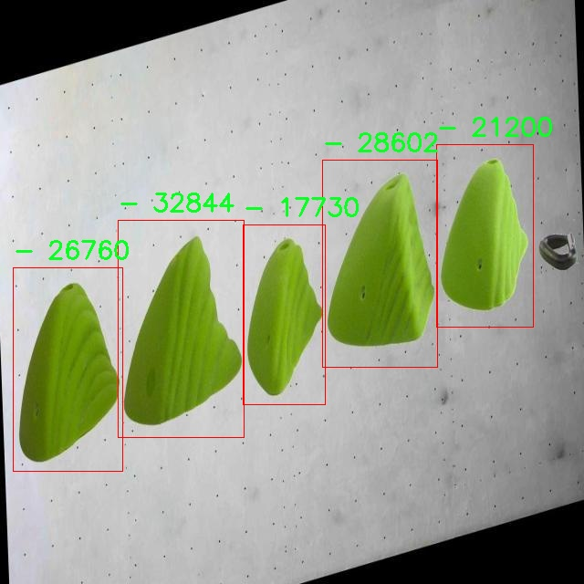
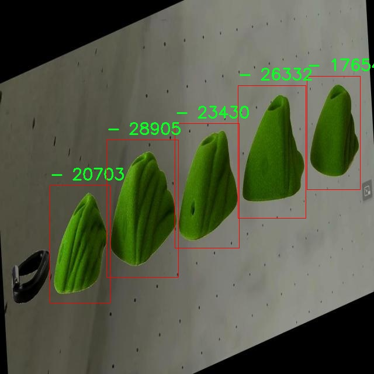
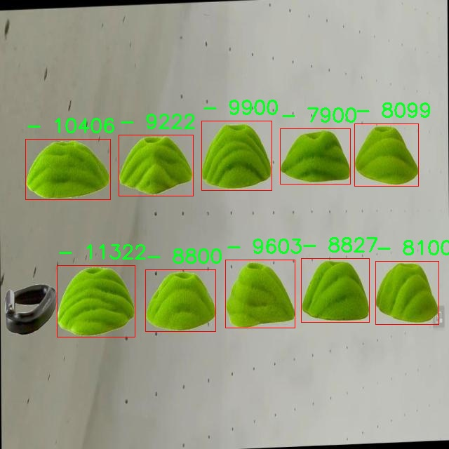
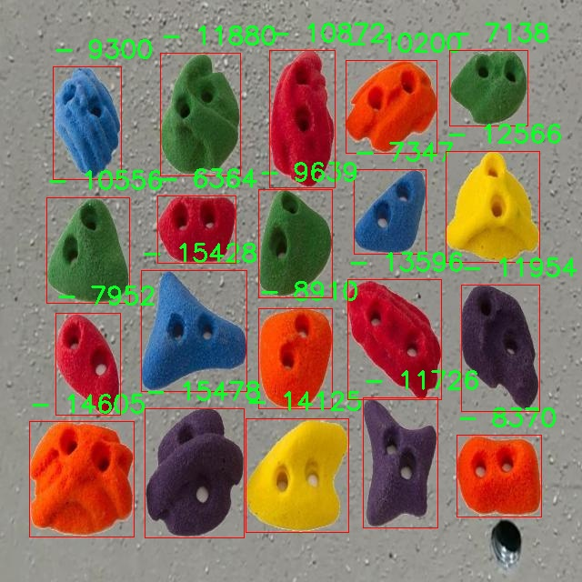

# 攀岩抓握点检测检测系统源码分享
 # [一条龙教学YOLOV8标注好的数据集一键训练_70+全套改进创新点发刊_Web前端展示]

### 1.研究背景与意义

项目参考[AAAI Association for the Advancement of Artificial Intelligence](https://gitee.com/qunshansj/projects)

项目来源[AACV Association for the Advancement of Computer Vision](https://gitee.com/qunmasj/projects)

研究背景与意义

攀岩作为一项极具挑战性和趣味性的运动，近年来在全球范围内迅速普及。随着攀岩运动的兴起，攀岩设施的建设和攀岩训练的需求也日益增加。在攀岩训练中，抓握点的选择与识别至关重要，因为它直接影响到攀岩者的表现和安全性。然而，传统的抓握点识别方法往往依赖于人工经验，不仅效率低下，而且容易受到主观因素的影响。因此，基于计算机视觉技术的自动化抓握点检测系统应运而生，成为提升攀岩训练效率和安全性的重要工具。

在众多计算机视觉算法中，YOLO（You Only Look Once）系列模型因其高效的实时目标检测能力而受到广泛关注。YOLOv8作为该系列的最新版本，进一步提升了检测精度和速度，适用于复杂环境下的目标识别任务。然而，攀岩抓握点的特征复杂多变，现有的YOLOv8模型在特定场景下的表现仍有待提升。因此，基于改进YOLOv8的攀岩抓握点检测系统的研究具有重要的理论与实践意义。

本研究将使用“Climbing Hold Training Dataset”作为数据基础，该数据集包含3303张图像，涵盖了两类攀岩抓握点。这一数据集的构建为攀岩抓握点的自动识别提供了丰富的样本，能够有效支持模型的训练与验证。通过对该数据集的深入分析，我们可以识别出攀岩抓握点的多样性及其在不同环境下的表现特征，为改进YOLOv8模型提供数据支撑。

在技术层面，本研究将对YOLOv8模型进行针对性的改进，主要包括数据增强、特征提取和模型优化等方面。通过引入新的数据增强技术，可以提高模型对不同光照、角度和背景的适应能力；而在特征提取方面，结合深度学习的最新进展，优化模型的网络结构，以提升其对攀岩抓握点的识别精度。最终目标是构建一个高效、准确的攀岩抓握点检测系统，能够实时分析攀岩者的抓握点选择，提供科学的训练建议。

此外，本研究的成果不仅限于攀岩领域的应用，还可以推广至其他需要实时目标检测的场景，如体育训练、机器人抓取等。这将为相关领域的研究提供新的思路和方法，推动计算机视觉技术的进一步发展。

综上所述，基于改进YOLOv8的攀岩抓握点检测系统的研究，既有助于提升攀岩训练的科学性和安全性，也为计算机视觉技术在特定应用场景中的发展提供了新的契机。通过本研究的深入探索，我们期望能够为攀岩运动的普及与发展贡献一份力量，同时推动相关技术的创新与应用。

### 2.图片演示







##### 注意：由于此博客编辑较早，上面“2.图片演示”和“3.视频演示”展示的系统图片或者视频可能为老版本，新版本在老版本的基础上升级如下：（实际效果以升级的新版本为准）

  （1）适配了YOLOV8的“目标检测”模型和“实例分割”模型，通过加载相应的权重（.pt）文件即可自适应加载模型。

  （2）支持“图片识别”、“视频识别”、“摄像头实时识别”三种识别模式。

  （3）支持“图片识别”、“视频识别”、“摄像头实时识别”三种识别结果保存导出，解决手动导出（容易卡顿出现爆内存）存在的问题，识别完自动保存结果并导出到tempDir中。

  （4）支持Web前端系统中的标题、背景图等自定义修改，后面提供修改教程。

  另外本项目提供训练的数据集和训练教程,暂不提供权重文件（best.pt）,需要您按照教程进行训练后实现图片演示和Web前端界面演示的效果。

### 3.视频演示

[3.1 视频演示](https://www.bilibili.com/video/BV1es4beYEYH/)

### 4.数据集信息展示

##### 4.1 本项目数据集详细数据（类别数＆类别名）

nc: 2
names: ['-', 'Climbing Hold Training Dataset - v1 2024-03-26 4-56pm']


##### 4.2 本项目数据集信息介绍

数据集信息展示

在攀岩运动的快速发展背景下，攀岩抓握点的检测与识别变得愈发重要。为了提升攀岩训练和比赛的效率，研究人员致力于开发一种改进的YOLOv8模型，以实现对攀岩抓握点的精准检测。为此，研究团队构建了一个名为“climbing detection”的数据集，专门用于训练和验证该系统。该数据集的设计旨在提供高质量的图像和标签，以支持深度学习模型的训练过程。

“climbing detection”数据集包含了攀岩抓握点的多样化样本，确保模型能够在不同环境和条件下进行有效的识别。数据集的类别数量为2，具体包括一个主要类别：“Climbing Hold Training Dataset - v1 2024-03-26 4-56pm”。这一类别不仅涵盖了各种攀岩抓握点的图像，还包含了不同角度、光照和背景下的样本，极大地丰富了数据集的多样性。这种多样性是训练深度学习模型的关键，因为它能够帮助模型学习到更加鲁棒的特征，从而在实际应用中表现出更高的准确性和可靠性。

在数据集的构建过程中，研究团队注重数据的标注质量。每一张图像都经过精确的标注，确保攀岩抓握点的位置和类别信息准确无误。这种高质量的标注不仅为模型的训练提供了坚实的基础，也为后续的模型评估和性能分析提供了可靠的数据支持。此外，数据集中的图像来源广泛，涵盖了不同类型的攀岩墙面，包括室内和室外的攀岩场地。这种多样化的场景设置使得模型在面对不同的攀岩环境时，能够保持较好的适应性。

为了进一步提升模型的性能，研究团队还计划对数据集进行扩展和更新。随着攀岩技术的不断进步和新型抓握点的出现，持续更新数据集将有助于模型保持最新的识别能力。研究人员将定期收集新的攀岩抓握点图像，并进行标注，以确保数据集的时效性和相关性。这种动态更新的策略将使得“climbing detection”数据集不仅仅是一个静态的资源，而是一个不断进化的工具，能够适应攀岩领域的变化。

总之，“climbing detection”数据集为改进YOLOv8的攀岩抓握点检测系统提供了坚实的基础。通过高质量的图像和准确的标注，该数据集不仅增强了模型的训练效果，也为未来的研究和应用提供了丰富的资源。随着数据集的不断扩展和更新，研究团队有信心将其应用于更广泛的攀岩训练和比赛场景中，为攀岩爱好者和专业运动员提供更为精准的抓握点检测支持。











### 5.全套项目环境部署视频教程（零基础手把手教学）

[5.1 环境部署教程链接（零基础手把手教学）](https://www.ixigua.com/7404473917358506534?logTag=c807d0cbc21c0ef59de5)


[5.2 安装Python虚拟环境创建和依赖库安装视频教程链接（零基础手把手教学）](https://www.ixigua.com/7404474678003106304?logTag=1f1041108cd1f708b01a)

### 6.手把手YOLOV8训练视频教程（零基础小白有手就能学会）

[6.1 手把手YOLOV8训练视频教程（零基础小白有手就能学会）](https://www.ixigua.com/7404477157818401292?logTag=d31a2dfd1983c9668658)

### 7.70+种全套YOLOV8创新点代码加载调参视频教程（一键加载写好的改进模型的配置文件）

[7.1 70+种全套YOLOV8创新点代码加载调参视频教程（一键加载写好的改进模型的配置文件）](https://www.ixigua.com/7404478314661806627?logTag=29066f8288e3f4eea3a4)

### 8.70+种全套YOLOV8创新点原理讲解（非科班也可以轻松写刊发刊，V10版本正在科研待更新）

由于篇幅限制，每个创新点的具体原理讲解就不一一展开，具体见下列网址中的创新点对应子项目的技术原理博客网址【Blog】：


[8.1 70+种全套YOLOV8创新点原理讲解链接](https://gitee.com/qunmasj/good)

### 9.系统功能展示（检测对象为举例，实际内容以本项目数据集为准）

图9.1.系统支持检测结果表格显示

  图9.2.系统支持置信度和IOU阈值手动调节

  图9.3.系统支持自定义加载权重文件best.pt(需要你通过步骤5中训练获得)

  图9.4.系统支持摄像头实时识别

  图9.5.系统支持图片识别

  图9.6.系统支持视频识别

  图9.7.系统支持识别结果文件自动保存

  图9.8.系统支持Excel导出检测结果数据


### 10.原始YOLOV8算法原理

原始YOLOv8算法原理

YOLOv8算法是Ultralytics公司在2023年推出的最新目标检测模型，它在前几代YOLO版本的基础上进行了重大改进，旨在提升检测性能和灵活性。YOLOv8不仅在速度和精度上实现了突破，还通过一系列创新的设计理念，推动了目标检测技术的发展。该算法的核心在于其独特的网络结构，主要由输入层、主干网络（Backbone）、颈部（Neck）和头部（Head）组成，每个部分都经过精心设计，以确保模型在处理各种复杂场景时的高效性和准确性。

首先，YOLOv8的输入层采用了640x640的标准图像尺寸，然而在实际应用中，图像的长宽比往往不一致。为了解决这一问题，YOLOv8引入了自适应图像缩放技术。在推理阶段，模型会将图像的长边按比例缩小到640像素，然后对短边进行填充。这种处理方式有效减少了信息冗余，提升了目标检测的速度和准确性。此外，在训练过程中，YOLOv8使用了Mosaic图像增强技术，通过随机选择四张图像进行缩放和拼接，生成新的训练样本。这种方法不仅增加了训练样本的多样性，还促使模型学习到不同位置和周围像素的特征，从而提高了预测精度。

在主干网络部分，YOLOv8的设计借鉴了YOLOv7中的ELAN模块，使用C2F模块替代了YOLOv5中的C3模块。C2F模块通过并行处理多个梯度流分支，确保了模型在保持轻量化的同时，能够获取更丰富的特征信息。这种设计使得YOLOv8在不同规模的模型中，能够灵活调整堆叠的层数，以适应不同的应用需求。通过这样的结构，YOLOv8能够在特征提取阶段有效捕捉到图像中的重要信息，为后续的目标检测奠定了坚实的基础。

在颈部结构方面，YOLOv8对YOLOv5的设计进行了优化，去除了多余的卷积连接层，直接对主干网络不同阶段输出的特征进行上采样。这一简化不仅减少了计算复杂度，还提高了特征融合的效率，使得模型能够更快地处理输入数据并生成更为准确的检测结果。

YOLOv8的头部结构是其最大的创新之一。与YOLOv5的Coupled-Head（耦合头）不同，YOLOv8采用了Decoupled-Head（解耦头）设计。具体而言，YOLOv8将检测和分类的卷积操作分开处理，使得模型在进行目标检测时能够更好地聚焦于目标的特征。这一设计不仅提高了模型的准确性，还使得损失函数的设计更加合理。YOLOv8在分类分支中使用了二值交叉熵损失（BCELoss），而在边界框回归分支中则采用了分布焦点损失（DFL）和CIoU损失。这种损失函数的组合，旨在使模型更快地聚焦于标签附近的区域，从而提高目标检测的精度。

值得注意的是，YOLOv8摒弃了传统的Anchor-Based（基于锚框）方法，转而采用Anchor-Free（无锚框）策略。这一转变意味着模型不再依赖于预设的锚框来进行目标检测，而是将目标检测任务转化为关键点检测。这种方法不仅简化了模型的结构，还增强了其泛化能力，使得YOLOv8能够在多种不同的数据集上表现出色。通过这种创新，YOLOv8能够更灵活地适应不同物体的检测需求，尤其是在处理形状和大小差异较大的目标时，表现尤为突出。

综上所述，YOLOv8算法通过对输入处理、特征提取、特征融合和目标检测等多个环节的创新设计，显著提升了目标检测的性能。其自适应图像缩放、Mosaic增强、C2F模块、解耦头部设计以及无锚框策略等特点，使得YOLOv8在速度和精度上均达到了新的高度。这些改进不仅使得YOLOv8在实时检测任务中表现优异，也为未来的目标检测研究提供了新的思路和方向。随着YOLOv8的推广应用，预计将在自动驾驶、智能监控、机器人视觉等领域发挥重要作用，推动相关技术的进一步发展。


### 11.项目核心源码讲解（再也不用担心看不懂代码逻辑）

#### 11.1 70+种YOLOv8算法改进源码大全和调试加载训练教程（非必要）\ultralytics\nn\extra_modules\ops_dcnv3\functions\__init__.py

以下是对您提供的代码的逐行分析和核心部分的保留，同时添加了详细的中文注释：

```python
# --------------------------------------------------------
# InternImage
# 版权所有 (c) 2022 OpenGVLab
# 根据 MIT 许可证进行许可 [详细信息请参见 LICENSE]
# --------------------------------------------------------

# 从当前包中导入 DCNv3Function 和 dcnv3_core_pytorch
# 这两个模块可能是实现深度可分离卷积或相关功能的核心组件
from .dcnv3_func import DCNv3Function, dcnv3_core_pytorch
```

### 核心部分分析
1. **模块导入**：这段代码的核心在于从当前包中导入 `DCNv3Function` 和 `dcnv3_core_pytorch`。这表明这两个组件在整个项目中可能扮演着重要的角色，尤其是在实现某种深度学习功能时。

2. **注释部分**：注释提供了关于版权和许可证的信息，说明该代码遵循 MIT 许可证，这是一种开源许可证，允许用户自由使用、复制和修改代码。

### 总结
这段代码主要是导入功能模块，后续代码中可能会使用这些导入的功能来实现具体的算法或模型。

这个文件是一个Python模块的初始化文件，位于一个名为`ops_dcnv3`的目录下，属于YOLOv8算法改进的源码的一部分。文件的开头包含了一些版权信息，表明该代码是由OpenGVLab于2022年开发的，并且是根据MIT许可证进行授权的。这意味着用户可以自由使用、修改和分发该代码，只要遵循许可证的条款。

在文件的主体部分，代码通过`from`语句导入了两个对象：`DCNv3Function`和`dcnv3_core_pytorch`。这两个对象很可能是在同一目录下的`dcnv3_func`模块中定义的。通过这种方式，用户在导入`ops_dcnv3`模块时，可以直接使用这两个功能，而无需显式地导入`dcnv3_func`模块。

`DCNv3Function`可能是一个实现了深度可分离卷积（Deformable Convolution）的类或函数，这种卷积操作在目标检测和图像分割等任务中可以提高模型的灵活性和性能。而`dcnv3_core_pytorch`则可能是与PyTorch框架相关的核心功能或实现，提供了与深度学习模型训练和推理相关的支持。

总的来说，这个初始化文件的主要作用是将特定的功能模块整合到一个包中，以便于后续的调用和使用，简化了用户的操作流程。

#### 11.2 70+种YOLOv8算法改进源码大全和调试加载训练教程（非必要）\ultralytics\nn\extra_modules\ops_dcnv3\modules\__init__.py

以下是代码中最核心的部分，并附上详细的中文注释：

```python
# 导入自定义的DCNv3模块
from .dcnv3 import DCNv3, DCNv3_pytorch, DCNv3_DyHead

# 这里的代码导入了三个类或函数：
# 1. DCNv3：可能是一个实现了深度可分离卷积的网络结构。
# 2. DCNv3_pytorch：可能是针对PyTorch框架的DCNv3实现。
# 3. DCNv3_DyHead：可能是一个动态头部模块，用于处理不同任务的输出。
```

这段代码的核心在于导入自定义模块中的关键组件，可能用于构建深度学习模型。

这个程序文件是一个Python模块的初始化文件，位于`ultralytics\nn\extra_modules\ops_dcnv3\modules`目录下。文件的开头包含了一些版权信息，表明该代码属于OpenGVLab，并且使用MIT许可证，这意味着用户可以自由使用、修改和分发该代码，只要遵循许可证的条款。

在文件的主体部分，代码通过`from`语句导入了三个类或函数：`DCNv3`、`DCNv3_pytorch`和`DCNv3_DyHead`。这些导入语句意味着该模块将提供这三个组件的功能，供其他模块或脚本使用。

具体来说，`DCNv3`可能是一个实现了深度可分离卷积（Deformable Convolution）的类，而`DCNv3_pytorch`则可能是该功能在PyTorch框架下的实现。`DCNv3_DyHead`可能是与动态头部（Dynamic Head）相关的实现，通常用于目标检测等任务中，以提高模型的灵活性和性能。

总的来说，这个初始化文件的主要作用是将这些功能模块整合到一个包中，方便其他部分的代码进行调用和使用。

#### 11.3 ui.py

```python
import sys
import subprocess

def run_script(script_path):
    """
    使用当前 Python 环境运行指定的脚本。

    Args:
        script_path (str): 要运行的脚本路径

    Returns:
        None
    """
    # 获取当前 Python 解释器的路径
    python_path = sys.executable

    # 构建运行命令，使用 streamlit 运行指定的脚本
    command = f'"{python_path}" -m streamlit run "{script_path}"'

    # 执行命令并等待其完成
    result = subprocess.run(command, shell=True)
    
    # 检查命令执行结果，如果返回码不为0，表示出错
    if result.returncode != 0:
        print("脚本运行出错。")


# 主程序入口
if __name__ == "__main__":
    # 指定要运行的脚本路径
    script_path = "web.py"  # 假设脚本在当前目录下

    # 调用函数运行脚本
    run_script(script_path)
```

### 代码注释说明：
1. **导入模块**：
   - `sys`：用于获取当前 Python 解释器的路径。
   - `subprocess`：用于执行外部命令。

2. **定义 `run_script` 函数**：
   - 接收一个参数 `script_path`，表示要运行的 Python 脚本的路径。
   - 使用 `sys.executable` 获取当前 Python 解释器的路径，以便在正确的环境中运行脚本。
   - 构建一个命令字符串，使用 `streamlit` 模块运行指定的脚本。
   - 使用 `subprocess.run` 执行命令，并等待其完成。
   - 检查命令的返回码，如果不为0，表示脚本运行出错，打印错误信息。

3. **主程序入口**：
   - 在 `if __name__ == "__main__":` 块中，指定要运行的脚本路径（这里假设为 `web.py`）。
   - 调用 `run_script` 函数，传入脚本路径以执行该脚本。

这个程序文件名为 `ui.py`，其主要功能是通过当前的 Python 环境运行一个指定的脚本，具体是一个名为 `web.py` 的文件。程序首先导入了必要的模块，包括 `sys`、`os` 和 `subprocess`，这些模块分别用于访问系统特性、操作系统功能和执行外部命令。

在文件中定义了一个名为 `run_script` 的函数，该函数接受一个参数 `script_path`，表示要运行的脚本的路径。函数内部首先获取当前 Python 解释器的路径，这通过 `sys.executable` 实现。接着，构建一个命令字符串，该命令用于调用 `streamlit` 运行指定的脚本。`streamlit` 是一个用于构建数据应用的库。

然后，使用 `subprocess.run` 方法执行构建好的命令，`shell=True` 参数允许在 shell 中执行该命令。执行后，函数检查返回码，如果返回码不为零，表示脚本运行出错，程序会打印出相应的错误信息。

在文件的最后部分，使用 `if __name__ == "__main__":` 判断当前模块是否为主程序。如果是，程序会调用 `abs_path` 函数获取 `web.py` 的绝对路径，并将其传递给 `run_script` 函数以运行该脚本。这样设计使得该模块可以被其他模块导入而不执行脚本，只有在直接运行时才会执行 `web.py`。

#### 11.4 code\ultralytics\nn\modules\utils.py

以下是经过简化和注释的核心代码部分：

```python
import torch
import torch.nn.functional as F

def inverse_sigmoid(x, eps=1e-5):
    """计算张量的反sigmoid函数。
    
    参数:
        x (torch.Tensor): 输入张量，值应在[0, 1]之间。
        eps (float): 为了避免除零错误，设置的最小值。
    
    返回:
        torch.Tensor: 输入张量x的反sigmoid值。
    """
    # 限制x的范围在0到1之间
    x = x.clamp(min=0, max=1)
    # 对x进行处理，确保不为零
    x1 = x.clamp(min=eps)
    x2 = (1 - x).clamp(min=eps)
    # 计算反sigmoid
    return torch.log(x1 / x2)

def multi_scale_deformable_attn_pytorch(
    value: torch.Tensor,
    value_spatial_shapes: torch.Tensor,
    sampling_locations: torch.Tensor,
    attention_weights: torch.Tensor,
) -> torch.Tensor:
    """
    多尺度可变形注意力机制。

    参数:
        value (torch.Tensor): 输入特征，形状为 (batch_size, num_channels, num_heads, embed_dims)。
        value_spatial_shapes (torch.Tensor): 特征图的空间形状。
        sampling_locations (torch.Tensor): 采样位置，形状为 (batch_size, num_queries, num_heads, num_levels, num_points, 2)。
        attention_weights (torch.Tensor): 注意力权重，形状为 (batch_size, num_heads, num_queries, num_levels, num_points)。

    返回:
        torch.Tensor: 经过多尺度可变形注意力后的输出特征。
    """
    bs, _, num_heads, embed_dims = value.shape  # 获取输入特征的维度
    _, num_queries, _, num_levels, num_points, _ = sampling_locations.shape  # 获取采样位置的维度

    # 将输入特征根据空间形状拆分为多个特征图
    value_list = value.split([H_ * W_ for H_, W_ in value_spatial_shapes], dim=1)
    # 将采样位置映射到[-1, 1]的范围
    sampling_grids = 2 * sampling_locations - 1
    sampling_value_list = []

    for level, (H_, W_) in enumerate(value_spatial_shapes):
        # 处理每个尺度的特征图
        value_l_ = value_list[level].flatten(2).transpose(1, 2).reshape(bs * num_heads, embed_dims, H_, W_)
        # 获取当前尺度的采样网格
        sampling_grid_l_ = sampling_grids[:, :, :, level].transpose(1, 2).flatten(0, 1)
        # 使用grid_sample进行双线性插值采样
        sampling_value_l_ = F.grid_sample(
            value_l_, sampling_grid_l_, mode="bilinear", padding_mode="zeros", align_corners=False
        )
        sampling_value_list.append(sampling_value_l_)

    # 处理注意力权重
    attention_weights = attention_weights.transpose(1, 2).reshape(
        bs * num_heads, 1, num_queries, num_levels * num_points
    )
    # 计算最终输出
    output = (
        (torch.stack(sampling_value_list, dim=-2).flatten(-2) * attention_weights)
        .sum(-1)
        .view(bs, num_heads * embed_dims, num_queries)
    )
    return output.transpose(1, 2).contiguous()  # 返回转置后的输出
```

### 代码注释说明：
1. **inverse_sigmoid函数**：该函数用于计算输入张量的反sigmoid值，主要用于将sigmoid输出的概率值转换回logits值，确保在数值计算中避免除零错误。
2. **multi_scale_deformable_attn_pytorch函数**：实现了多尺度可变形注意力机制，输入为特征图、空间形状、采样位置和注意力权重，输出为经过注意力机制处理后的特征。函数内部通过对特征图进行分割、采样位置的映射以及双线性插值，最终结合注意力权重生成输出特征。

这个程序文件主要包含了一些用于深度学习模型的实用工具函数，特别是与多尺度可变形注意力机制相关的功能。文件的开头引入了一些必要的库，包括 `copy`、`math`、`numpy` 和 `torch`，并定义了一些全局可用的函数。

首先，`_get_clones` 函数用于创建一个给定模块的克隆列表。它接受一个模块和一个整数 `n`，返回一个包含 `n` 个深拷贝模块的 `ModuleList`，这在构建具有多个相同层的网络时非常有用。

接下来，`bias_init_with_prob` 函数用于根据给定的先验概率初始化卷积或全连接层的偏置值。它通过计算先验概率的对数几率来返回一个偏置初始化值，这在模型训练时可以帮助提高收敛速度。

`linear_init` 函数用于初始化线性模块的权重和偏置。它使用均匀分布在一个特定的范围内初始化权重，并在存在偏置的情况下也对其进行初始化。这种初始化方法有助于提高模型的性能。

`inverse_sigmoid` 函数计算给定张量的反sigmoid函数。它首先将输入张量限制在0到1之间，然后通过对数运算计算反sigmoid值。这个函数在一些特定的计算中可能会用到，例如在处理概率时。

最后，`multi_scale_deformable_attn_pytorch` 函数实现了多尺度可变形注意力机制。该函数接受四个参数：`value`、`value_spatial_shapes`、`sampling_locations` 和 `attention_weights`。函数内部首先获取输入张量的形状信息，并将 `value` 按照空间形状进行分割。接着，计算采样网格并通过 `F.grid_sample` 函数对每个尺度的特征进行采样。最后，结合注意力权重对采样值进行加权求和，返回最终的输出结果。

整体来看，这个文件提供了一些深度学习模型中常用的工具函数，尤其是在实现复杂的注意力机制时，能够有效地支持模型的构建和训练。

#### 11.5 70+种YOLOv8算法改进源码大全和调试加载训练教程（非必要）\ultralytics\utils\callbacks\raytune.py

以下是经过简化和注释的核心代码部分：

```python
# 导入Ultralytics YOLO的设置
from ultralytics.utils import SETTINGS

# 尝试导入Ray和Tune库，并检查Ray Tune集成是否启用
try:
    assert SETTINGS['raytune'] is True  # 确保Ray Tune集成已启用
    import ray
    from ray import tune
    from ray.air import session
except (ImportError, AssertionError):
    tune = None  # 如果导入失败或集成未启用，则将tune设置为None

def on_fit_epoch_end(trainer):
    """在每个训练周期结束时，将训练指标发送到Ray Tune。"""
    if ray.tune.is_session_enabled():  # 检查Ray Tune会话是否启用
        metrics = trainer.metrics  # 获取当前训练指标
        metrics['epoch'] = trainer.epoch  # 添加当前周期信息
        session.report(metrics)  # 将指标报告给Ray Tune

# 如果tune可用，则定义回调函数；否则，回调为空字典
callbacks = {
    'on_fit_epoch_end': on_fit_epoch_end, 
} if tune else {}
```

### 代码注释说明：
1. **导入设置**：首先从`ultralytics.utils`导入`SETTINGS`，以获取配置参数。
2. **Ray和Tune的导入**：使用`try-except`结构来导入Ray库及其Tune模块，并检查Ray Tune是否启用。如果未能导入或未启用，则将`tune`设置为`None`。
3. **回调函数**：定义`on_fit_epoch_end`函数，该函数在每个训练周期结束时被调用，用于将训练指标发送到Ray Tune。
   - 在函数内部，首先检查Ray Tune会话是否启用。
   - 获取当前的训练指标，并将当前周期的编号添加到指标中。
   - 使用`session.report(metrics)`将指标报告给Ray Tune。
4. **回调字典**：根据`tune`的可用性，创建一个包含回调函数的字典。如果`tune`不可用，则回调字典为空。

这个程序文件是一个用于YOLOv8算法改进的回调函数模块，主要用于与Ray Tune集成，以便在训练过程中监控和记录训练指标。首先，文件引入了Ultralytics库中的设置模块，并检查Ray Tune的集成是否启用。如果设置中`raytune`为真，则会导入Ray及其相关模块；如果没有成功导入或者集成未启用，则`tune`会被设置为`None`。

接下来，定义了一个名为`on_fit_epoch_end`的函数，该函数在每个训练周期结束时被调用。函数内部首先检查Ray Tune的会话是否已启用，如果启用，则从训练器中获取当前的训练指标，并将当前的周期数添加到指标中。最后，通过`session.report(metrics)`将这些指标报告给Ray Tune，以便进行进一步的分析和可视化。

最后，文件创建了一个名为`callbacks`的字典，如果`tune`不为`None`，则将`on_fit_epoch_end`函数作为回调函数添加到字典中。这使得在训练过程中能够灵活地使用Ray Tune进行监控和调优。整体来看，这段代码的目的是为了实现YOLOv8模型训练过程中的指标记录与调优，提升模型的训练效率和效果。

#### 11.6 train.py

以下是代码中最核心的部分，并附上详细的中文注释：

```python
class DetectionTrainer(BaseTrainer):
    """
    DetectionTrainer类，继承自BaseTrainer类，用于基于检测模型的训练。
    """

    def build_dataset(self, img_path, mode="train", batch=None):
        """
        构建YOLO数据集。

        参数:
            img_path (str): 包含图像的文件夹路径。
            mode (str): 模式，可以是'train'或'val'，用户可以为每种模式自定义不同的增强。
            batch (int, optional): 批次大小，仅适用于'rect'模式。默认为None。
        """
        gs = max(int(de_parallel(self.model).stride.max() if self.model else 0), 32)
        return build_yolo_dataset(self.args, img_path, batch, self.data, mode=mode, rect=mode == "val", stride=gs)

    def get_dataloader(self, dataset_path, batch_size=16, rank=0, mode="train"):
        """构造并返回数据加载器。"""
        assert mode in ["train", "val"]  # 确保模式是'train'或'val'
        with torch_distributed_zero_first(rank):  # 仅在DDP情况下初始化数据集*.cache一次
            dataset = self.build_dataset(dataset_path, mode, batch_size)  # 构建数据集
        shuffle = mode == "train"  # 训练模式下打乱数据
        if getattr(dataset, "rect", False) and shuffle:
            LOGGER.warning("WARNING ⚠️ 'rect=True'与DataLoader的shuffle不兼容，设置shuffle=False")
            shuffle = False  # 如果'rect'为True，禁用打乱
        workers = self.args.workers if mode == "train" else self.args.workers * 2  # 根据模式设置工作线程数
        return build_dataloader(dataset, batch_size, workers, shuffle, rank)  # 返回数据加载器

    def preprocess_batch(self, batch):
        """对一批图像进行预处理，包括缩放和转换为浮点数。"""
        batch["img"] = batch["img"].to(self.device, non_blocking=True).float() / 255  # 将图像转换为浮点数并归一化
        if self.args.multi_scale:  # 如果启用多尺度
            imgs = batch["img"]
            sz = (
                random.randrange(self.args.imgsz * 0.5, self.args.imgsz * 1.5 + self.stride)
                // self.stride
                * self.stride
            )  # 随机选择新的尺寸
            sf = sz / max(imgs.shape[2:])  # 计算缩放因子
            if sf != 1:  # 如果缩放因子不为1
                ns = [
                    math.ceil(x * sf / self.stride) * self.stride for x in imgs.shape[2:]
                ]  # 计算新的形状
                imgs = nn.functional.interpolate(imgs, size=ns, mode="bilinear", align_corners=False)  # 进行插值缩放
            batch["img"] = imgs  # 更新批次图像
        return batch  # 返回处理后的批次

    def get_model(self, cfg=None, weights=None, verbose=True):
        """返回YOLO检测模型。"""
        model = DetectionModel(cfg, nc=self.data["nc"], verbose=verbose and RANK == -1)  # 创建检测模型
        if weights:
            model.load(weights)  # 加载权重
        return model  # 返回模型

    def plot_training_samples(self, batch, ni):
        """绘制带有注释的训练样本。"""
        plot_images(
            images=batch["img"],
            batch_idx=batch["batch_idx"],
            cls=batch["cls"].squeeze(-1),
            bboxes=batch["bboxes"],
            paths=batch["im_file"],
            fname=self.save_dir / f"train_batch{ni}.jpg",
            on_plot=self.on_plot,
        )  # 绘制图像并保存

    def plot_metrics(self):
        """从CSV文件中绘制指标。"""
        plot_results(file=self.csv, on_plot=self.on_plot)  # 保存结果图像
```

### 代码核心部分说明：
1. **DetectionTrainer类**：用于YOLO模型的训练，继承自BaseTrainer类，提供了一系列训练所需的方法。
2. **build_dataset方法**：构建YOLO数据集，支持训练和验证模式，并根据模式应用不同的数据增强。
3. **get_dataloader方法**：构造数据加载器，支持多线程加载和数据打乱，确保在分布式训练中只初始化一次数据集。
4. **preprocess_batch方法**：对输入的图像批次进行预处理，包括归一化和多尺度调整。
5. **get_model方法**：创建并返回YOLO检测模型，可以选择加载预训练权重。
6. **plot_training_samples和plot_metrics方法**：用于可视化训练样本和训练指标，帮助监控训练过程。

这个程序文件 `train.py` 是一个用于训练 YOLO（You Only Look Once）目标检测模型的实现，继承自 `BaseTrainer` 类。文件中主要包含了数据集构建、数据加载、模型设置、训练过程中的损失计算和可视化等功能。

首先，程序导入了一些必要的库和模块，包括数学运算、随机数生成、深度学习框架 PyTorch 相关的模块，以及 YOLO 相关的功能模块。接着定义了 `DetectionTrainer` 类，该类专门用于处理基于检测模型的训练。

在 `DetectionTrainer` 类中，`build_dataset` 方法用于构建 YOLO 数据集，接收图像路径、模式（训练或验证）和批次大小作为参数。它会根据模型的步幅计算出合适的尺寸，并调用 `build_yolo_dataset` 函数来创建数据集。

`get_dataloader` 方法则负责构建数据加载器。它会根据传入的模式（训练或验证）来初始化数据集，并设置是否打乱数据。对于训练模式，数据会被打乱，而在验证模式下，数据不会被打乱。这个方法还考虑了分布式训练的情况，确保数据集只初始化一次。

`preprocess_batch` 方法用于对每个批次的图像进行预处理，包括将图像缩放到适当的大小并转换为浮点数。该方法还支持多尺度训练，通过随机选择图像的尺寸来增强模型的鲁棒性。

`set_model_attributes` 方法用于设置模型的属性，包括类别数量和类别名称。这些信息是从数据集中提取的，以确保模型能够正确识别不同的目标。

`get_model` 方法返回一个 YOLO 检测模型实例，可以选择加载预训练的权重。`get_validator` 方法则返回一个用于验证模型性能的验证器。

在训练过程中，`label_loss_items` 方法用于返回带有标签的损失字典，方便跟踪训练过程中的损失情况。`progress_string` 方法返回一个格式化的字符串，显示训练进度，包括当前的 epoch、GPU 内存使用情况、损失值、实例数量和图像大小。

`plot_training_samples` 方法用于绘制训练样本及其标注，便于可视化训练数据的质量。最后，`plot_metrics` 和 `plot_training_labels` 方法用于从 CSV 文件中绘制训练过程中的指标和生成带标签的训练图，帮助分析模型的训练效果。

总体而言，这个文件实现了 YOLO 模型训练的各个环节，从数据准备到模型训练和结果可视化，提供了一个完整的训练框架。

### 12.系统整体结构（节选）

### 整体功能和构架概括

该项目是一个基于YOLOv8的目标检测模型训练和改进框架，包含多个模块和功能，旨在提供高效的训练、评估和推理能力。项目结构清晰，主要包括以下几个部分：

1. **模型定义与改进**：实现了YOLOv8及其变种（如Pose、SAM、RTDETR等）的模型结构和训练逻辑，支持多种算法改进。
2. **数据处理**：提供数据集构建、转换和加载的功能，确保数据能够被有效地输入到模型中进行训练。
3. **训练与验证**：实现了训练过程的控制，包括损失计算、指标监控和可视化，支持与Ray Tune等工具的集成以进行超参数调优。
4. **工具函数**：包含多种实用工具函数，帮助简化模型构建和训练过程中的常见任务。

### 文件功能整理表

| 文件路径                                                                                          | 功能描述                                                                                         |
|---------------------------------------------------------------------------------------------------|--------------------------------------------------------------------------------------------------|
| `ultralytics/nn/extra_modules/ops_dcnv3/functions/__init__.py`                                   | 初始化模块，导入DCNv3相关功能，支持可变形卷积操作。                                               |
| `ultralytics/nn/extra_modules/ops_dcnv3/modules/__init__.py`                                    | 初始化模块，导入DCNv3、DCNv3_pytorch和DCNv3_DyHead，提供多种卷积操作实现。                        |
| `ui.py`                                                                                           | 运行web.py脚本的界面，提供命令行接口以启动模型训练和评估。                                       |
| `ultralytics/nn/modules/utils.py`                                                                 | 提供多种实用工具函数，包括模型克隆、初始化、损失计算和多尺度可变形注意力机制的实现。               |
| `ultralytics/utils/callbacks/raytune.py`                                                        | 与Ray Tune集成的回调函数，监控训练过程中的指标并进行报告。                                        |
| `train.py`                                                                                        | 训练YOLO模型的主程序，负责数据集构建、模型训练、损失计算和可视化等功能。                          |
| `ultralytics/models/yolo/pose/__init__.py`                                                      | 初始化YOLO Pose模型模块，提供相关功能和类的导入。                                               |
| `ultralytics/data/converter.py`                                                                  | 数据转换工具，负责将数据集格式转换为YOLO所需的格式。                                            |
| `ultralytics/nn/modules/__init__.py`                                                             | 初始化神经网络模块，导入各类网络组件和功能。                                                    |
| `ultralytics/models/sam/modules/sam.py`                                                          | 实现SAM（Segment Anything Model）相关功能的模块。                                               |
| `ultralytics/models/sam/amg.py`                                                                  | 实现AMG（Adaptive Mask Generation）相关功能的模块。                                             |
| `code/ultralytics/models/rtdetr/model.py`                                                        | 实现RTDETR（Real-Time DEtection TRansformer）模型的定义和训练逻辑。                             |
| `code/ultralytics/models/yolo/obb/train.py`                                                     | 训练YOLO OBB（Oriented Bounding Box）模型的主程序，负责数据加载和训练过程控制。                 |

这个表格提供了每个文件的功能概述，帮助理解整个项目的结构和各个模块的作用。

注意：由于此博客编辑较早，上面“11.项目核心源码讲解（再也不用担心看不懂代码逻辑）”中部分代码可能会优化升级，仅供参考学习，完整“训练源码”、“Web前端界面”和“70+种创新点源码”以“13.完整训练+Web前端界面+70+种创新点源码、数据集获取”的内容为准。

### 13.完整训练+Web前端界面+70+种创新点源码、数据集获取


# [下载链接：https://mbd.pub/o/bread/ZpuUmpxp](https://mbd.pub/o/bread/ZpuUmpxp)